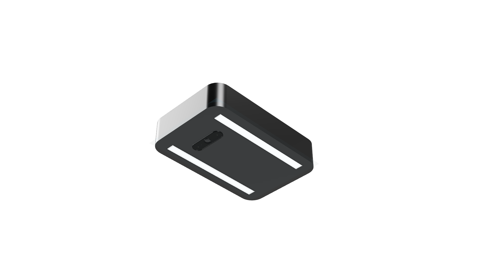

# Products

At Easysort, we have two main products. We are currently focusing on the Easysort 1.0, with the Easysort Sorting System being our future, complete solution.

## Easysort 1.0

The Easysort 1.0 is: Lights + Camera + AI + Onboard Compute + Data management all in one unit.

It is currently being used to detect incoming waste and notify the user of critical detections, generate reports generally on the waste stream and link waste scans to specific trucks.

It functions well as quality control for incoming waste streams on conveyor belts.

## Easysort Sorting System

The Easysort Sorting System is: Easysort Eye + Robotic Sorting System + Control System + Analytics.

You give the system any kind of mixed waste stream from 90% pure to residual waste and you get a complete sorted waste stream.

We are currently investigating the best way to do robotic sorting. Generally 3 main options are investigated:
1. Delta Robot (Easy to implement, high precision, cheaper, slower speeds)
2. Smart Conveyor (Pushing waste through actuators in conveyor. High speeds, high precision, expensive and hard to implement)
3. Air cylinder (Blasting waste with air to move it. High speeds, difficult to move heavy objects, hard to implement)
